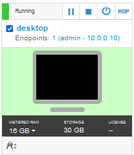

# Reserve a single environment for demos or self-enablement

Need support? Contact **Kevin Postreich**

|         |           |  
| ------------- |:-------------|
|    | <strong>IMPORTANT:</strong>    A Skytap lab environment is provided for the labs/demos in this asset.   Environment reservations are immediate and can be reserved for up to two weeks in duration.   Use the instructions below to reserve your demo/lab environment. 

<!--
<table>
<tbody>
<tr class="odd">
<td></td>
<td>
<strong>IMPORTANT!</strong>

Reserving an environment ONLY applies if you are performing this lab as self-paced outside of an instructor led virtual lab.

A Skytap cloud lab environment is required for performing the lab.

In <strong>self-paced mode</strong>, you are required to request an environment using the instructions provided below.

Otherwise, in an <strong>instructor led</strong> lab, the lab instructor will provide access to pre-provisioned lab environment.
</td>
</tr>
</tbody>
</table>
-->

1.  Use the link below to access the **Teach Your Monolith to Dance** workshop environment reservations page.  

    <https://techzone.ibm.com/my/reservations/create/60ff1bdb3e00b8001fdf3b2f>

    a.  Use your **IBM ID** to login to the IBM Technology Zone

    b.  The **Create a reservation** page is displayed

     
	 
	  

2.  Select “**Reserve for Now**” Radio button, and then follow the
    on-screen dialog to reserve an environment in a Skytap data center
    in the closest Geography (US-Central, EMEA, Asia Pacific)
    
    a.  The environment **name** should be pre-filled with “**Environment:  Teaching Your Monolith to Dance**”
    
    b.  **Purpose**: Select a `purpose` from the drop-down menu
	
	 
    
    c.  **Customer name(s)**: If, in the "Purpose" field, you selected `demo`, `proof of technology` or `proof of concept`, then customer name(s) is a required field. Enter customer name(s).
	
	d.  **Description**: Enter a description. The field is required.
    
    e.  **End date and time**: Use the calendar widget and select the
        maximum date available (2 weeks from date of reservation)
    
    f.  **Select a time**: Select a time of day for reservation to
        expire
    
    g.  Select a **timezone** nearest to you

    

     

3.  Preferred Geography: Choose a Skytap datacenter in the closest
    geography (US, EMEA, Asia Pacific)

    
	
	 

4.  One complete, click on the “**Submit**” Button

     

5.  The reservation takes a moment to be created. When it is created,
    click on the “**My reservations**”
     button to see the detail so of
    the environment reservation.

    **Note:** The details of your environment reservation are displayed.

6.  Take not of the **Username** and **Password**. Then click the
     icon to navigate to the Launch
    page.

    
	
	 

7.  Click the “**Open Your Skytap Environment**” link.

     

8.  Enter the **Desktop Password** for the VM access, that was generated
    for your environment. Click **Submit** button.

    

### **The lab environment**

Six Linux VM has been provided for this lab. The environment should start automatically and will take several minutes to be **ready**. 

If the environment does not automatically start, click the **start** icon at the top of the VMs list, to start **ALL** of the VMs.

**Note:** If the Skytap Cloud environment resources approach capacity limits, you may experience delays in **stating** the environment. If this occurs, you will see `rate limited` messages. Not to worry, the environment will start, but just be delayed while the system is busy. Under certain circumstances, it may take up to **20 minutes** for the environment to start.

**Note:** The `desktop` VM is the VM you will login to and use in the lab.

The login credentials for the **desktop** image is:

  - User ID: **ibmuser**
 
  - Password: **engageibm\!**

Now you are ready to use the specific lab guides to setup for demos or self-enablement. 

The labs are available from the **Navigation** pane on the left side of the page. 

### **How do I find my environment in IBM Technology Zone**

You may have reserved an environment for multiple days, up to two weeks. Let's say you shutdown your laptop for the day and need to access your environment at a later date, within the reservation period. 

This section describes how to find your environment reservations in the IBM Technology Zone. 

1. Go to the IBM technology Zone URL: https://techzone.ibm.com/
2. Login using your IBM ID, if requested. 
3. From the main menu in Tech Zone, navigate to **My Library > My Reservations**

    

     

4. Select the **Teaching your monolith to dance** reservation

    

