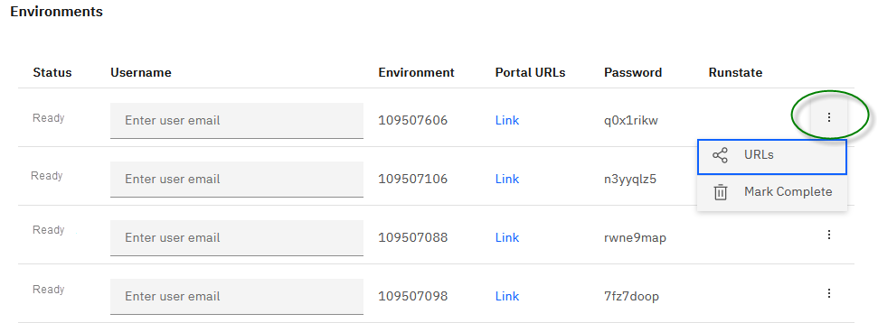
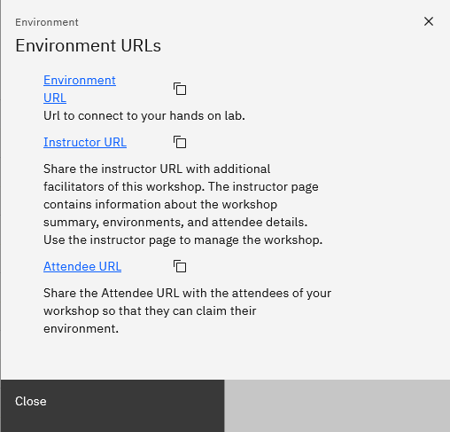

# Create a Workshop 

**Reserves multiple environments for customer facing workshops**

Need support? Contact **Kevin Postreich**

|         |           |  
| ------------- |:-------------|
|    | <strong>IMPORTANT:</strong>    A Skytap lab environment is provided for this workshop.   Workshop reservations must be made at least `72 hours` in advance of the scheduled workshop.   Once the workshop is **requested** it is created in a `pending` state, awaiting approval by the infrastructure team.    When the workshop is approved, its state is moved to `approved`.  Use the instructions below to create your workshop request.   DTE Workshop infrastructure and environment support can be obtained via `slack` [#dte_workshop_support](https://ibm-cloud.slack.com/archives/CTA2MV9AM) or email **dte@us.ibm.com** 

1.  Use the link below to access the **Teach Your Monolith to Dance** workshop environment reservations page.  

    <https://techzone.ibm.com/my/reservations/create/60ff1bdb3e00b8001fdf3b2f>

    a.  Use your **IBM ID** to login to the IBM Technology Zone

    b.  The **Create a reservation** page is displayed

     
	 
	  

2.  Select “**Schedule a workshop**” Radio button, and then follow the
    on-screen dialog to schedule a workshop in a Skytap data center
    in the closest Geography (US-Central, EMEA, Asia Pacific)
	
	The **Workshop Manager request form** is displayed. Requesting a workshop is a multi-page request form. 
	
	The form is divided into sections, which are reflected by the **Tabs** across the top. You must fill in ALL required fields on each page before you can go to the next page. 
    
	
	
	 
	
#### Complete the Info page of the workshop request form	
	
1. Read the important details of workshop scheduling on the **Info** page. Click the `next` button to continue to the next page. 	
	
     	

#### Complete the Environment Information page of the workshop request form	

1. Complete the `Step 1` **Environment Information** page of the form
	
    a.  The environment **name** should be pre-filled with “**Environment:  Teaching Your Monolith to Dance**”
    
    b.  **Environment Template Region Selection**: Select the Geography closest to your workshop location
	
	 
    
	c. Click the `Next` button
	
	 
	
#### Complete the Workshop Justification page of the workshop request form	

1. 	Complete the `Step 2` **Workshop Justification** page
	
	a.  **IBM Product**: Type `liberty` in the field. Type SLOWLY. There is a performance BUG related to how the list is automatically displayed based on the content you type. 
	
	b. Select any product from the list: 
	
	   Example: **IBM WebSphere Application Server Liberty Core**
	
	  **Note:** Unfortunately, the product list is very out dated and WebSphere Hybrid Edition is not in the list. This information is irrelevant to the workshop reservation but is a required field. 
		
	c.  **Workshop Phase**: Select the Phase of the customer engagement that most closely aligns to your situation. This field is required. 
    
	
	
	 
	
	d. **Sales Opportunity Number:** If you have an opportunity number, you may provide that in this field. The field is optional. 
	
	
	e. **Customer Company Name(s):** Yu may enter customer company names to be included in the workshop request. The field is optional. 
		
	f. Click the `Next` button
	
     

#### Complete the Scheduling Information page of the workshop request form	

1. Complete the `Step 3` **Scheduling Information** page

    This page includes important scheduling details and affects when and how your workshop is scheduled. Please take care to provide accurate details. 
   
    **Note:** The workshop request can be updated after submission, up until it is approved. 

    a. ** Instructors:** Provide a _comma delimited_ list of email addresses of all of the workshop instructors. 
	
	  **Note:** Instructors will be authorized access to the Workshop **Instructor Portal** where attendee environments can be observed. 

	b.  **Workshop Delivery Audience:** Select `Internal` or `External` from the drop-down list. The field is required. 
	
	  
	
        

    c. **Number of Environments:** Enter the numeric value of the number of environments you want to have provisioned for the workshop. 

       This value can be LESS than the number of actual attendees that join. An **Auto-grow** feature selection under the **advanced settings** can be used to automatically add environments as needed for the workshop in case you reach maximum environment limit.  	

      
    d. **Number of Attendees:** Enter the numeric value of the number of attendees you expect to have at the workshop. 
	
	   Workshops should have some specified limit of attendees, as not to overwhelm the instructors and result in less than favorable delivery and customer satisfaction of the workshop. 

    e. **Start Date  / Time:** Using the date and time widgets, enter the date, time, and Time zone that the workshop should be scheduled to start. 

       This is the date and time that the automated scheduling system should have your environments available and ready. Personally, I specify 30 minutes to 60 minutes earlier than the actual start time of the workshop just in case there are technical difficulties. 
  
      
	
        
	  
	 f. **End Date  / Time:** Using the date and time widgets, enter the date, time, and Time zone that the workshop should be scheduled to end. 

       This is the date and time that the automated scheduling system should shutdown your environments. Personally, I specify 60 minutes to 120 minutes later that the actual workshop end time just in case the workshop runs longer than expected. 
  
      
	
        
  
   
#### ADVANCED SETTINGS on the Scheduling information page. 

Under the **Scheduling Information** page, there are advanced settings that further shape when the environments should be deployed, removed, and grow. 

These advanced settings are optional. The workshop scheduler has default values for deploying and removing environments based on the workshop start / end times that you setup. 
   
1. **Auto Stop Limit:** This field specifies how long an environment must be idle before it either shuts down or suspends the environment. The default time is 180 minutes. 

      

2. **Auto Stop Behavior:** This field determines the action to take when an environment is idle for the duration specified in the **Auto Stop Limit** field. 

     **TIP:** When the environment includes Redhat OpenShift, ALWAYS specify SHUTDOWN. OpenShift cannot routinely be resumed from a suspended state. 
   
      

3. **Deploy On:** This field can be used to specify the date and time for the scheduler to start deploying the environments. 

      **TIP:** Specify approximately 2 hours prior to your workshop to provide sufficient time for the environments to start.  
   
      
   
4. **Remove On:** This field can be used to specify the date and time for the scheduler to remove the environments. 

      **TIP:** Specify approximately 1 hour after your workshop is scheduled to end.  
	  
      
   
5. **Enable Auto Grow:** Use this field to specify that you want the number of environments to increase if you reach the maximum number of environments that were deployed. The default value is **NO**

      

6. **Auto grow step size:**  When auto grow is triggered this filed determines how many environment should be added at a time. The default value is **1**. 

      
	 
7. **Auto grow max:**  Specify the maximum number of environments allowed. 

    Example: If you specified 20 environments, and you want to be able to add 5 additional environments, then this value should be set to 25.  

     

8. Click `Next` when ready to go to the next page of the workshop scheduler form. 

 
#### Complete the Workshop Information page of the workshop request form	

1. 	Complete the `Step 4` **Workshop Information** page
	
	a.  **Workshop Title**: Enter a title for your workshop. This title is searchable in your list of scheduled workshops. Attendees will see this this title.
	
	b.  **Workshop Description**: Enter a short description of the workshop. Attendees will see this description 
    
	c. **Physical Location - Region:** From the drop-down list, select the Region of the workshop. 
	
	c. **Physical Location - Physical Location:** For virtual workshops, enter the WEBEX or Meeting URL of the workshop. 
		
	e. **Workshop Password:** Enter a password for the workshop. This is a password that all attendees must enter in order to access the Workshop. As the instructor, you will need to share tis password with the workshop attendees. 
	
	f. **Guide URL:** If you have a URL to the Workshop or Lab guides, you can enter it here. This URL is displayed on the workshop page for attendees to see. 
	
	g. **Survey URL:** If you have a URL to a workshop survey, you can enter it here. This URL is displayed on the workshop page for attendees to see. 
	
	h. Click the `Submit` button to reserve the workshop
	
     

### **How do I find my workshop and Environment URLs in IBM Technology Zone**

#### **Access the workshop in IBM Technology Zone**

After you submit the workshop request, the workshop details are available in the IBM Technology Zone.

This section describes how to find your workshops in the IBM Technology Zone. 

1. Go to the IBM technology Zone URL: https://techzone.ibm.com/
2. Login using your IBM ID, if requested. 
3. From the main menu in Tech Zone, navigate to **My Library > My Workshops**

    

     

4. You will see your workshops listed. The one you just submitted will be in **Pending Approval** state. 

    

5. When the workshop is approved, the state changes to `Approved`, and you have the ability to view the details of the workshop, view the list of environments, and obtain the `Instructor URL` and `Attendee URL` for the Workshop. 

   

   

#### **Obtain the Instructor and Attendee environment URLs for the workshop**

Once the workshop is deployed as scheduled, the **Instructor URL** and **Attendee URL** for the workshop can be obtained from the workshop details. 

 When the workshop is approved, the state changes to `Approved`, and you have the ability to obtain the `Instructor URL` and `Attendee URL` for the Workshop. 

1. Click the **View** icon next to your workshop

    

    
	
	 
   
2. Click the **3 vertical dots** next to any of the environments listed. Then Select the **URLS** item from the action menu. 

    
	
	 
   
3. The **Instructor URL** and **Attendee URL** are shown. 

   
     Share the **Instructor URL** with the additional instructors of the workshop. The instructor page contains information about the workshop summary, environments, and attendee details.
   
     Use the instructor page to manage the workshop 
   
     Share the **Attendee URL** with the attendees of your workshop so they can claim one of the environments. 
   
     Once an attendee claims an environment, the instructor page shows the email address of the attendees using the environment. 
   
      
	
	   

       

### The workshop environment

Each workshop attendee has access to their own lab environment. 

The lab environment contains Six Linux VMs. When the workshop scheduler completes the environment deployments, the environment should start automatically and will take several minutes to be **ready**. 

**Note:** The `desktop` VM is the VM you will login to and use in the lab.

The login credentials for the **desktop** image is:

  - User ID: **ibmuser**
 
  - Password: **engageibm\!**

Now you are ready to use the specific lab guides to setup for demos or self-enablement. 

The labs are available from the **Navigation** pane on the left side of the page.
