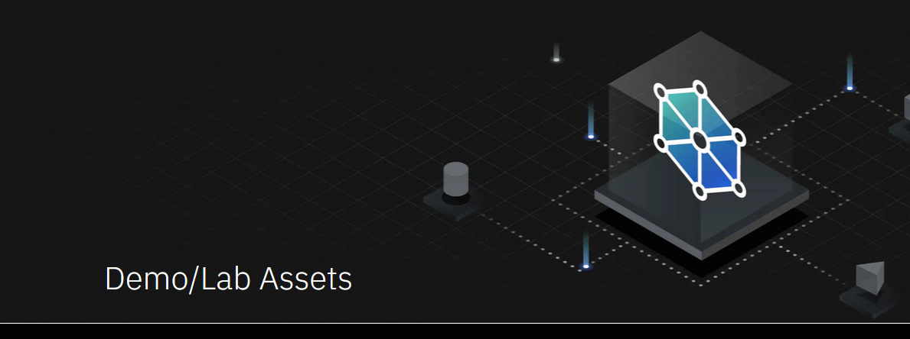

# <h1 style="color:green">Teaching Your Monolith to Dance </h1>

<h3 style="color:green"> Hands on WebSphere Application Moderinization Journey from VMs to containers on OpenShift</h3>

**Last updated:** July 2021

This material is designed as a Demo/Lab/Workshop asset that includes the following WebSphere Application Modernization use cases: 

  - Containerization Basics
  - Operational Modernization
  - Runtime Modernization
  - Devops Modernization 
  - Application Management Modernization 

Application modernization is a journey of moving existing applications to a more modern cloud-native infrastructure.

There are several approaches to application modernization and provided are key reference implementations to help you on your modernization journey.

<h3 style="color:green">Operational Modernization</h3>

- **Repackage** the application to deploy within a container but maintaining a monolith application without changes to the application or runtime. This solution uses IBM Transforation Advisor and the Runtime Component Operator, supported by IBM WebSphere Hybrid Edition, to deploy and manage the containerized application on Red Hat OpenShift.

<h3 style="color:green">Runtime Modernization</h3>

- **Update the application runtime to Open Liberty**, a suitable cloud-native framework. Modernize some aspects of the application by taking advantage of MicroProfile specifications, such as Health, Metrics, JWT, Config and OpenAPI. This solution uses Open Liberty Operator, also supported by IBM WebSphere Hybrid Edition, to deploy and manage the modernized application on Red Hat OpenShift.

<h3 style="color:green">Application Management</h3>
- **Monitor the applications** easily using various dashboards such as Kibana and Grafana. Identify potential problems using logging dashboards. Get insights into the performance of your applications using metrics dashboards. Perform Day-2 operations, such as gathering traces and dumps, to debug potential issues easily using Open Liberty Operator. 

<h3 style="color:green">Devops Modernization</h3>

- **Continuous Integration and Continuous Deployment (CI/CD)** of applications is critical for repeatable and reliable deployments. Modern devops technologies such as Tekton and Argo CD are designed for Kubernetes (OSCP) and provide the CI/CD capabilities, and fully integrated and supported in OSCP via Kubernetes Operators.

<h1 style="color:green">Hands-on Workshop</h1>

<h4 style="color:green">Reserve lab environments</h4>

Please follow the [setup instructions](common/setup.md) to reserver a lab environemnt, or schedule a workshop. The lab environemtn is configured with the tools you need to be able to complete the labs.

<h3 style="color:green">Containerization Labs</h3>

Basic knowledge about containers, OpenShift, and BM Transfromation Advisor is recommended. Completing the following hands-on labs will help you to easily navigate this workshop:

- Lab 1: [Introduction to Containerization](./basic-labs/HelloContainer/README.md)
- Lab 2: [Introduction to Container Orchestration using OpenShift](./basic-labs/IntroOpenshift/README.md)
- Lab 3: [Introduction to IBM Transformation Advisor](./basic-labs/TA/README.md)

<h3 style="color:green">Appplication Modernization Labs</h3>

- Lab 3: [Operational Modernization](./appmod-labs/OperationalModernization/README.md)
- Lab 4: [Runtime Modernization](./appmod-labs/RuntimeModernization/README.md)
- Lab 5: [Application Management](./appmod-labs/ApplicationManagement/README.md)

<h3 style="color:green">DevOps Modernization Labs</h3>

- Lab 6: [Openshift Pipelines](./devops-labs/pipelines/README.md)
- Lab 7: [GitOps with ArgoCD](./devops-labs/argocd/README.md)

